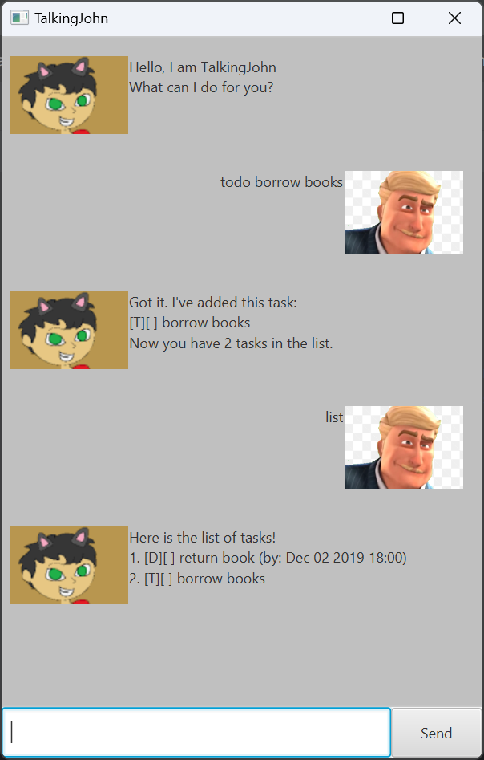

# TalkingJohn User Guide



TalkingJohn is a desktop app used for **managing tasks, optimized for use via a Command Line Interface (CLI)** while still having the benefits of a **Graphical User Interface (GUI)**.

## Features
- Add Todo Task `todo`
- Add Deadline Task `deadline`
  - Dates are in the form `dd/MM/yyyy HHmm`
- Add Event Task `event`
- Listing all Tasks `list`
- Find Task by keyword `find`
- Mark Task as done `mark`
- Unmark Task as not done `unmark`
- Deleting a task `delete`
- Saving the tasks `bye`
- Notes can be added when adding tasks
- Commands are **case-sensitive**

## Adding Todo
Add a task you have to do!

_Example:_ `todo borrow books`

```
Got it. I've added this task:

[T][ ] borrow books

Now you have 3 tasks in the list.
```
You can add notes to the Todo task

_Example:_ `todo borrow books :visit mart`

*Tasks notes will be in square brackets*

```
Got it. I've added this task:

[T][ ] borrow books [visit mart]

Now you have 3 tasks in the list.
```

## Adding deadlines

Add a task with a deadline!

_Example:_ `deadline return book /by 18/07/2024 2100`

Date and time **MUST** be in (*dd/MM/yyyy HHmm*) format.

```
Got it. I've added this task:

[D][ ] return book (by: Jul 18 2024 21:00)

Now you have 3 tasks in the list.
```

You can add notes to the Deadline task

_Example:_ `deadline return book :visit mart/by 18/07/2024 2100`

```
Got it. I've added this task:

[D][ ] return book [visit mart](by: Jul 18 2024 21:00)

Now you have 3 tasks in the list.
```

## Adding events
Add a task with a time period! **(from: ... to:)**

_Example:_ `event project meeting /from Wed 2pm /to Friday 4pm`

Date and Time format **not** fixed for events.

```
Got it. I've added this task:

[E][ ] project meeting (from: Wed 2pm to: Friday 4pm)

Now you have 3 tasks in the list.
```

You can add notes to the Event task

_Example:_ `event project meeting :check this month's sales report/from Wed 2pm /to Friday 4pm`

```
Got it. I've added this task:

[E][ ] project meeting [check this month's sales report](from: Wed 2pm to: Friday 4pm)

Now you have 3 tasks in the list.
```

## List Tasks
List all the tasks you have saved!

_Example:_ `list`


```
Here is the list of tasks!
1. [D][ ] return book (by: Jul 18 2024 21:00)
2. [T][ ] buy eggs
3. [T][ ] borrow books
```
### Try using todo and deadline to get the list above!

## Find Tasks
Iterates through the list to find tasks which contains the keyword

_Example:_ `find book`

The 2 tasks below contains the keyword 'book'.

```
1. [D][ ] return book (by: Jul 18 2024 21:00)
2. [T][ ] borrow books
```

## Mark/Unmark Tasks
Mark or unmark tasks to show if it has been done.

_Example:_ `list`

*Task 2 has been marked*

```
Here is the list of tasks!
1. [D][ ] return book (by: Jul 18 2024 21:00)
2. [T][X] buy eggs
3. [T][ ] borrow books
```

_Example:_ `mark 1`

```
Nice! I've marked this task as done:
[D][X] return book (by: Jul 18 2024 21:00)
```

_Example:_ `unmark 2`

```
OK, I've marked this task as not done:
[T][ ] buy eggs
```

_Example:_ `list`

```
Here is the list of tasks!
1. [D][X] return book (by: Jul 18 2024 21:00)
2. [T][ ] buy eggs
3. [T][ ] borrow books
```

## Delete Tasks

_Example:_ `delete 2`

```
Noted. I've removed this task:
[T][ ] buy eggs
Now you have 2 tasks in the list.
```

_Example:_ `list`

```
Here is the list of tasks!
1. [D][X] return book (by: Jul 18 2024 21:00)
2. [T][ ] borrow books
```

## Save Tasks

Save the tasks onto your local computer.

_Example:_ `bye`

Tasks are saved onto your local computer. You can now view the same tasks even if you restart the application :)

```
Bye, hope to see you soon!
Tasks have been saved :)
```

## Command Summary

- todo (*description*) + (**optional Notes**) : Adds a todo task.
- deadline (*description*) + (**optional Notes**) /by <dd/MM/yyyy HHmm> : Adds a deadline task.
- event (*description*) + (**optional Notes**) /from <start date> /to <end date> : Adds an event task.
- list: Lists all tasks.
- mark (task number): Marks a task as done.
- unmark (task number): Unmarks a task.
- delete (task number): Deletes a task.
- find (keyword): Finds tasks with a certain keyword.
- bye: Saves the tasks.